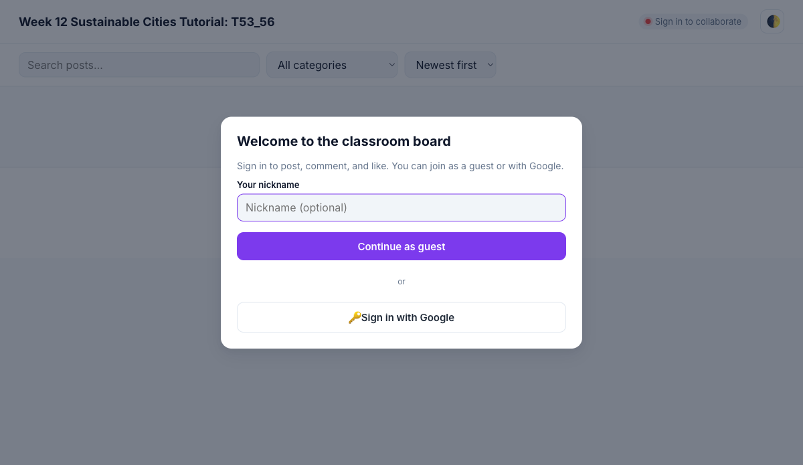

<div align="center">

# Sustainable Cities Tutorial — Classroom Board

[](https://developer.mozilla.org/en-US/docs/Web/HTML)
[](https://developer.mozilla.org/en-US/docs/Web/CSS)
[](https://developer.mozilla.org/en-US/docs/Web/JavaScript)
[](https://firebase.google.com/)
[](https://firebase.google.com/products/firestore)
[](https://pages.github.com/)

**Real-time Padlet-style collaborative board for Week 12 Sustainable Cities Tutorial: T53_56**

Plain HTML/CSS/JS · Firebase Auth + Firestore + Storage · No build step

</div>

## Screenshot



## About

A single-page collaborative board where students can post ideas, upload images, comment, and like — all in real time. Built intentionally without a build step or framework so it can be served from any static host (including GitHub Pages) and edited by reloading the browser.

### Key Features

- **Auth** — Anonymous sign-in (with optional nickname) or Google.
- **Posts** — Title, description, category, optional image upload, optional link.
- **Categories** — Urban Planning · Green Transport · Renewable Energy · Waste Management · Smart Cities · Water Sustainability · Community Ideas.
- **Real-time** — Posts, likes, comments, and the announcement banner update live across all connected users.
- **Likes & Comments** — One-tap heart toggle; threaded comments inside the post detail modal.
- **Edit / delete** — Authors manage their own posts and comments.
- **Admin** — Pin posts, delete any post or comment, edit announcement banner, export CSV.
- **Search & filter** — Free-text search, category filter, sort by newest / oldest / most liked.
- **UI** — Masonry layout, light/dark theme, FAB, toasts, online indicator, mobile responsive.

## Tech Stack

| Category       | Technology                                       |
| -------------- | ------------------------------------------------ |
| Frontend       | HTML5, CSS3, Vanilla JavaScript (ES Modules)     |
| Auth           | Firebase Authentication (Anonymous + Google)     |
| Database       | Cloud Firestore (real-time subscriptions)        |
| Storage        | Firebase Storage (post images)                   |
| Hosting        | GitHub Pages / any static host                   |
| Tooling        | None — no bundler, no package manager, no tests  |

## Architecture

```
┌────────────────────────────────────────────────────────────┐
│                     Browser (index.html)                   │
│                                                            │
│   styles.css        js/main.js  ◄── owns state + DOM       │
│                          │                                 │
│      ┌───────────────────┼─────────────────────┐           │
│      ▼                   ▼                     ▼           │
│   ui.js               auth.js              admin.js        │
│   (DOM helpers)       posts.js             (CSV export)    │
│                       comments.js                          │
│                       settings.js                          │
│                          │                                 │
│                          ▼                                 │
│                      firebase.js  (auth/db/storage)        │
└──────────────────────────┼─────────────────────────────────┘
                           │  modular SDK 12.12.1
                           ▼
            ┌──────────────────────────────┐
            │   Firebase (gstatic CDN)     │
            │   Auth · Firestore · Storage │
            └──────────────────────────────┘
```

## Project Structure

```
.
├── index.html              # Single-page shell
├── styles.css              # All styling (light + dark theme)
├── js/
│   ├── config.js           # Firebase config + admin emails  (gitignored)
│   ├── config.example.js   # Template — copy to config.js
│   ├── firebase.js         # initializeApp + auth/db/storage singletons
│   ├── auth.js             # Anonymous + Google sign-in
│   ├── posts.js            # Post CRUD + real-time subscription
│   ├── comments.js         # Comment CRUD + real-time subscription
│   ├── settings.js         # Announcement banner read/write
│   ├── admin.js            # Admin check + CSV export
│   ├── ui.js               # DOM helpers, modal, toast
│   └── main.js             # Boot + render + wiring
├── screenshot.png
└── README.md
```

## Setup

The Firebase project (`padlet-7c3eb`) already exists. Steps to wire it up:

1. **Auth providers** — Firebase Console → Authentication → Sign-in method → enable **Anonymous** and **Google**.
2. **Firestore** — Create database (production mode). Paste the rules from [Firestore rules](#firestore-rules) below.
3. **Storage** — Click "Get Started" in Storage. Paste the rules from [Storage rules](#storage-rules) below.
4. **Local config** — copy the template:
   ```bash
   cp js/config.example.js js/config.js
   ```
   Then paste your real Firebase config into `js/config.js`. That file is gitignored.
5. **Admin emails** — edit `ADMIN_EMAILS` in `js/config.js` to list teacher accounts.
6. **Run locally**:
   ```bash
   python3 -m http.server 8000
   ```
   Open http://localhost:8000.

> **API key note.** Firebase web API keys are public-by-design; they identify the project, not authorize it. Real protection comes from the security rules below and (recommended) restricting the key by HTTP referrer in the Google Cloud Console before deploying publicly.

## Firestore rules

Paste into Firebase Console → Firestore → Rules.
**Edit the `isAdmin()` function** to match your `ADMIN_EMAILS`.

```
rules_version = '2';
service cloud.firestore {
  match /databases/{db}/documents {
    function isSignedIn() { return request.auth != null; }
    function isAdmin() {
      return isSignedIn()
        && request.auth.token.email in ['angch@tertiaryinfotech.com'];
    }

    match /posts/{postId} {
      allow read: if isSignedIn();
      allow create: if isSignedIn()
        && request.resource.data.authorId == request.auth.uid
        && request.resource.data.pinned == false;
      allow update: if isAdmin()
        || (isSignedIn()
            && resource.data.authorId == request.auth.uid
            && request.resource.data.authorId == resource.data.authorId
            && request.resource.data.pinned == resource.data.pinned)
        || (isSignedIn()
            && request.resource.data.diff(resource.data).affectedKeys().hasOnly(['likes', 'updatedAt']));
      allow delete: if isAdmin() || (isSignedIn() && resource.data.authorId == request.auth.uid);
    }

    match /comments/{commentId} {
      allow read: if isSignedIn();
      allow create: if isSignedIn() && request.resource.data.authorId == request.auth.uid;
      allow delete: if isAdmin() || (isSignedIn() && resource.data.authorId == request.auth.uid);
      allow update: if false;
    }

    match /settings/board {
      allow read: if isSignedIn();
      allow write: if isAdmin();
    }
  }
}
```

## Storage rules

Paste into Firebase Console → Storage → Rules.

```
rules_version = '2';
service firebase.storage {
  match /b/{bucket}/o {
    match /post-images/{userId}/{file=**} {
      allow read: if request.auth != null;
      allow write: if request.auth != null
                   && request.auth.uid == userId
                   && request.resource.size < 8 * 1024 * 1024
                   && request.resource.contentType.matches('image/.*');
      allow delete: if request.auth != null && request.auth.uid == userId;
    }
  }
}
```

## Smoke test

Open the app in two browser windows side-by-side:

1. Window A signs in anonymously as "Alex"; Window B signs in with Google as the admin.
2. A creates a post with title, description, *Green Transport* category, an uploaded image, and a link → both windows see it instantly.
3. B (admin) clicks **Pin** → the post jumps to the top in both windows.
4. A clicks the heart → like count updates live in B.
5. A opens the post and adds a comment → B sees the comment appear in real time.
6. A edits their own post → updates everywhere; admin can also edit the announcement banner.
7. B clicks **Export CSV** → a CSV downloads with one row per post.
8. Toggle dark mode in either window → preference persists in localStorage.
9. Search "transport", filter category "Green Transport", sort "Most liked" → board narrows correctly.

## Deployment

This is a static site — any host that serves files works. The repo is configured for **GitHub Pages** publishing from the repository root. After enabling Pages in the repository Settings, the live URL appears as `https://<owner>.github.io/<repo>/`.

Other options:

- **Netlify / Vercel** — drop the folder, no build command, publish directory `.`.
- **Firebase Hosting** — `firebase init hosting` with public directory `.` and `firebase deploy`.

## Contributing

1. Fork the repo and create a feature branch.
2. Edit a file and reload the browser — that's the full dev loop.
3. Open a pull request with a short description and a screenshot if it's a UI change.

## Developed By

**Tertiary Infotech Academy Pte. Ltd.**

## Acknowledgements

- [Firebase](https://firebase.google.com/) for Auth, Firestore, and Storage.
- [Padlet](https://padlet.com/) for inspiring the collaborative-board format.
- Students of T53_56 for the Sustainable Cities tutorial content.

---

<div align="center">

If this project is useful to you, please ⭐ the repo.

</div>
